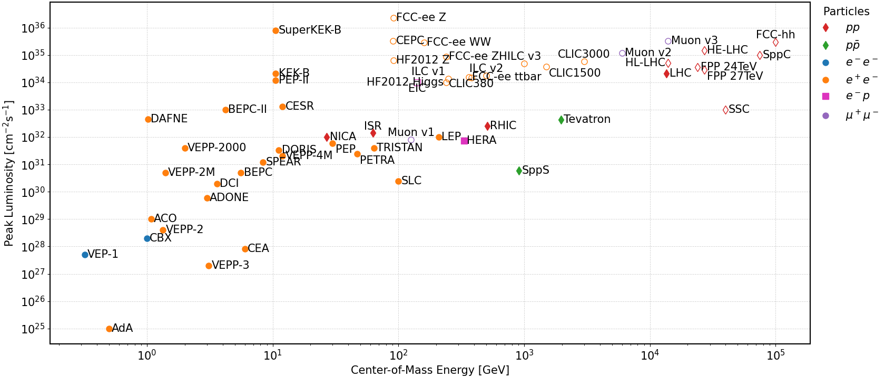

#  Accelerator Timeline

[](https://github.com/pylhc/accelerator_timeline/)
[](https://github.com/pylhc/accelerator_timeline/)
<!-- [](https://doi.org/) -->

In this package, the main parameters of major historical, modern and possible future accelerators are 
collected, including references to the origin of the collected data, into a single csv:

 -  [accelerator-parameters.csv](accelerator-parameters.csv).


## Installation 

This package is mostly for collecting and sharing the data of the accelerators within
the CSV file. 


To get the data, either download the [accelerator-parameters.csv](accelerator-parameters.csv) directly, 
or clone the repository via `git`, e.g.::

```
git clone https://github.com/pylhc/accelerator_timeline.git
```

## Example Scripts

In addition, small python scripts are provided to explore the data via and create Livingston-like plots.
These charts are available interactively at:
 
 - [pylhc.github.io/accelerator_timeline](https://pylhc.github.io/accelerator_timeline).

The python code itself can be found at

 - [interactive_charts.py](interactive_charts.py), creating the interactive charts via plotly.
 - [export_charts.py](export_charts.py), making publication-grade exports to pdf via matplotlib.

The requirements for the scripts can be found in the respective `requirements_*.txt` file.


