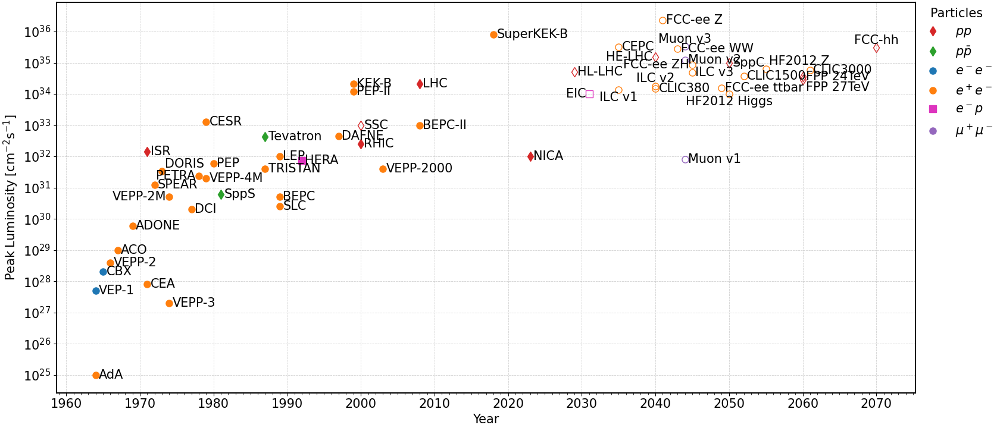

# Accelerator Timeline

In this package, the main parameters of major historical, modern and possible future accelerators are 
collected, including references to the origin of the collected data, into a single csv,
which can be found at: [accelerator-parameters.csv](accelerator-parameters.csv).

In addition, small python scripts are provided to explore the data via and create Livingston-like plots plotly:
[interactive.py](interactive.py)
 
as well as for publication export to pdf via matplotlib:
[export_charts.py](export_charts.py) .

